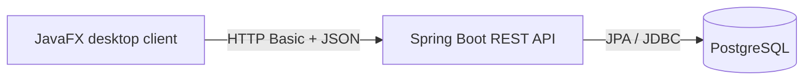
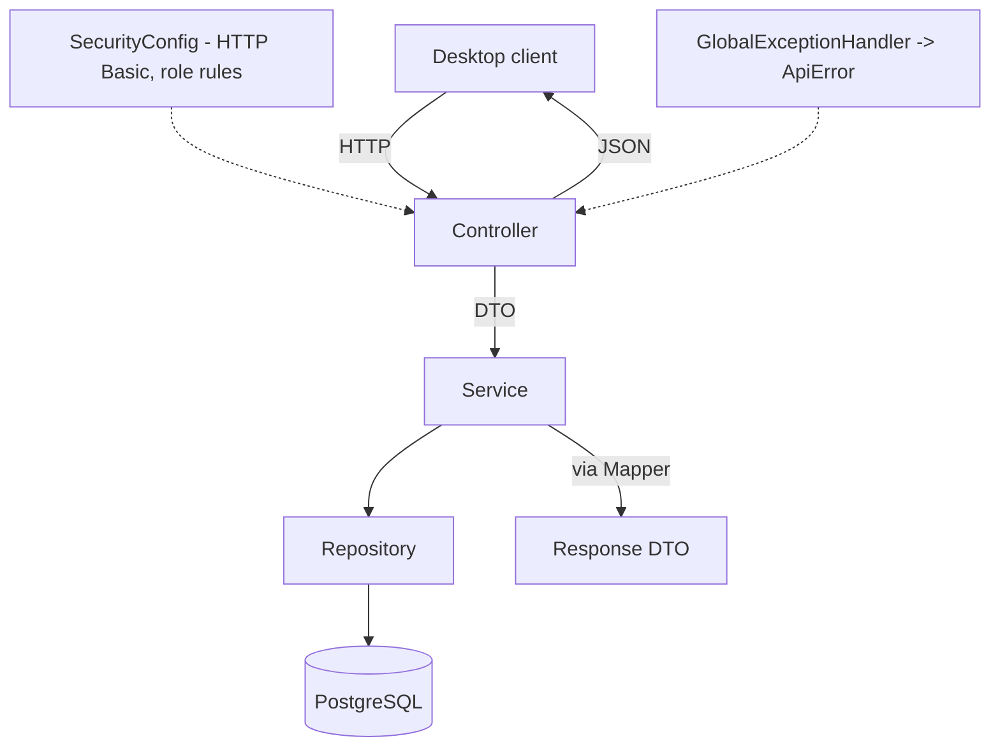
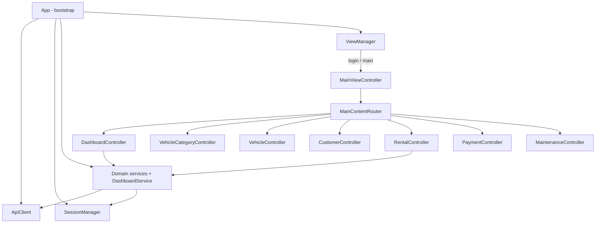
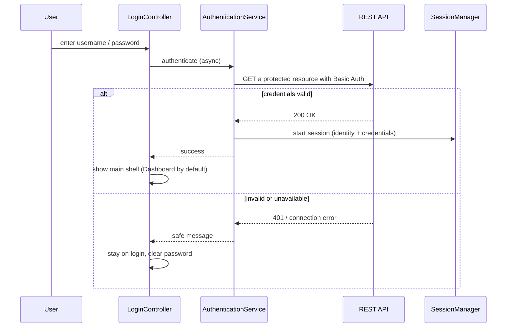
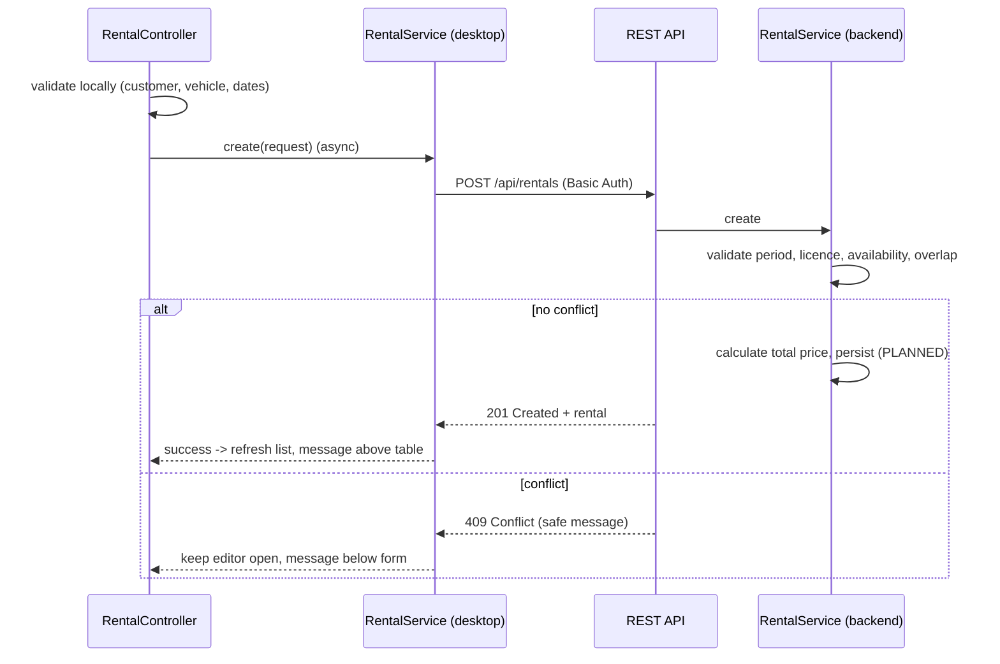
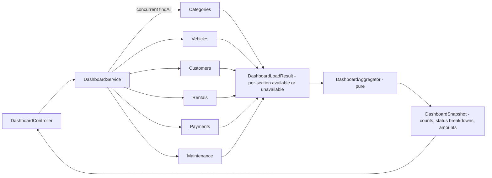
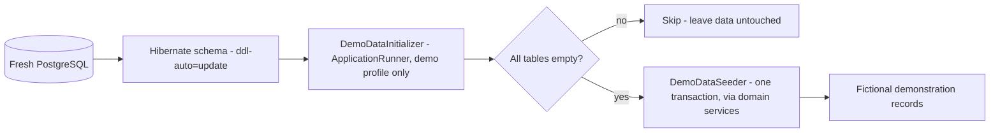

# Architecture

This document describes the architecture of Easy Car Rent: the overall system, the
backend layering, the desktop-client structure, and the main runtime workflows.

## System architecture

The desktop client talks to the REST API over HTTP with Basic authentication and
JSON payloads. The API is the only component that touches the database.

- The **desktop client** contains no business rules of record: it validates input
  for a responsive experience but every operation is confirmed by the API.
- The **API** holds all validation, overlap, status-transition, price/amount, and
  authorization rules.
- **PostgreSQL** stores the domain data; it is reached only through the API.

## Backend layering

The backend follows a strict layered request flow. Controllers handle HTTP only;
services hold business rules; repositories perform persistence; entities are the JPA
model; DTOs are the API contract; mappers convert between them.

Key backend rules:

- **Controllers** map endpoints and status codes; they contain no business logic
  and never return entities directly.
- **Services** own the domain rules (overlap, transitions, price/amount, protected
  deletes) and run write operations in transactions.
- **Repositories** perform queries only.
- **GlobalExceptionHandler** translates domain and framework exceptions into a
  consistent `ApiError` (`400`/`401`/`403`/`404`/`409`/`500`) with no stack traces
  or credentials.
- **SecurityConfig** applies HTTP Basic and the per-endpoint role rules.

## Desktop-client structure

The desktop client is assembled once at startup with a single shared `ApiClient`
and a single shared `SessionManager`. `ViewManager` switches between the login and
main views; `MainContentRouter` swaps the central content between the seven
sections; each section has its own controller, view-state, and message-state.

Design constraints (verified):

- one shared `ApiClient` and one shared `SessionManager`; logout clears the session
  used by every service (the backend-health check uses a separate anonymous
  client);
- controllers construct no `HttpClient` and contain no endpoint paths;
- services contain no JavaFX types;
- all API calls are asynchronous (`CompletableFuture` + `Platform.runLater`); there
  are no blocking `.join()`/`.get()` calls in production UI code;
- server-owned fields (status, calculated price, derived amount, timestamps) are
  read-only in the client;
- form errors render below the active editor, general/list feedback above the
  table, and a stale form message is never left above the table.

Each domain screen is built from a small set of JavaFX-free, unit-tested pieces: a
response/request DTO, a service, a validator, a permissions model, a view-state, and
a message-state, plus the controller and FXML. The dashboard adds a pure
`DashboardAggregator`, an immutable `DashboardSnapshot`, and `DashboardLoadResult`
for partial-failure handling.

## Authentication workflow

## Rental booking workflow

## Dashboard load workflow

The dashboard loads the six domain lists concurrently and aggregates them; one
failing source becomes an "Unavailable" section rather than hiding the others.

## Demonstration data startup (demo profile)

For demonstrations, an optional `demo` profile can populate a fresh database with a
fictional dataset. The initializer is profile-gated, runs after the schema is
available, seeds only an empty database, and is not a production migration mechanism.

- **Profile-gated:** the initializer, seeder and their clock exist only under the
  `demo` profile; the default startup registers none of them.
- **Empty-only and idempotent:** a non-empty database is detected and skipped, so a
  repeated demo startup creates no duplicates and never resets existing data.
- **Rules preserved:** records are created through the existing domain services, so the
  same validation, overlap, price/amount and vehicle-status rules apply.
